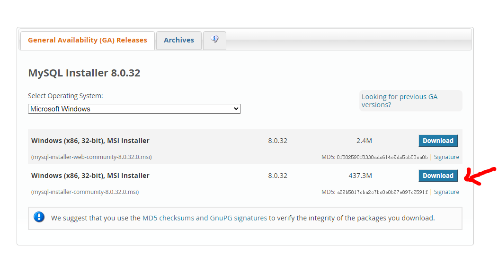

# MySQL

## MySQL的介绍:

- MySQL 是一个开源的关系型数据库,原开发者为瑞典的MySQL AB公司；
- 2008年被Sun公司收购,2009年被，Sun被Oracle收购;
- 目前MySQL归属于Oracle

> MySQL 是一个关系型数据库，本质上就是一款软件、一个程序;
>
> - 这个重新种管理着多个数据库
> - 每个数据库可以有多张表
> - 每张表中又可以有多条数据
>
> 又称为:DBMS数据库管理系统


## MySQL下载

点击下载地址[https://dev.mysql.com/downloads/installer/](https://dev.mysql.com/downloads/installer/)



> **``推荐下载第二个``**：第一个体积小功能相对应也会少；

下载完了之后在本地服务中查看MySQL是否启动


在终端中输入MySQL

```
C:/> mysql -v
```

查看当前数据库版本


## 连接数据库

 ### 用户和密码

在终端中连接数据库需要: 用户名和密码

> 用户名用 -u 连接 -uname
>
> 密码用 -p表示 也可以直接在 -p 后面输入密码

在终端输入

[^大小写加数字]: 密码组合方式

```
C:/ > mysql -uroot -p
```

会有以下结果


### 查看当前的数据库有哪些

命令

> show databases;


## 数据库操作

### 查看数据库

> show databases;

一般情况下MySQL会有自己默认的数据库:

- information_schema:信息数据库,其中包括MySQL在维护的其他数据库、表、列、访问权限等信息;
- perfornance_schema:性能数据库,记录着MySQL Server数据库引擎在运行过程中的一些资源消耗相关的信息
- mysql: 用于存储数据库管理者的用户信息、权限信息以及一些日志信息等；
- sys: 相当于是一个简易版的 perfornance_schema, 将性能数据库中的数据汇总成更容易理解的形式；

### 创建数据库

> create database 数据库的名字；(不推荐)
>
> create database databaseName;
>
> create database if not exists databaseName;(推荐)
>
> 如果数据库不存在才创建数据库

### 删除数据库

> drop database 数据库名
>
> drop database databaseName

### 进入数据库

> use 数据库名
>
> use databaseName

### 创建表

> create table tableName

在创建表的同时, 规定表中的数据

> create table tableName(
>
> ​	name varchar(10),
>
> ​	age int
>
> )

### 查看表

> show tables

### 插入数据

>```
>INSERT INTO table_name ( field1, field2,...fieldN )
>                       VALUES
>                       ( value1, value2,...valueN );
>```

如果数据是字符型，必须使用单引号或者双引号，如："value"。

> insert into tableName ( name , age ) values ( "Bitin" , 23 );

### 删除数据

> ``` 
> DELETE FROM '表'; (慎用)
> DELETE FROM '表' where '要删除的条件';(正常使用的语法)
> ```
>
> 

### 更新数据

> ```
> update '表' SET '要修的字段 = 修改值' where '条件修改那一条数据'；
> 
> 在表中添加一个新的时间字段并且设置默认值为当前时间
> update table '表' add '字段' TIMESTAMP DEFAULT CURRENT_TIMESTAMP ON UPDATE CURRENT_TIMESTAMP
> ```
>
> 

### 查询数据

>```
>SELECT column_name,column_name FROM table_name [WHERE Clause]
>[LIMIT N][ OFFSET M]
>```
>
>- 查询语句中你可以使用一个或者多个表，表之间使用逗号(,)分割，并使用WHERE语句来设定查询条件。
>- SELECT 命令可以读取一条或者多条记录。
>- 你可以使用星号（*）来代替其他字段，SELECT语句会返回表的所有字段数据
>- 你可以使用 WHERE 语句来包含任何条件。
>- 你可以使用 LIMIT 属性来设定返回的记录数。
>- 你可以通过OFFSET指定SELECT语句开始查询的数据偏移量。默认情况下偏移量为0。

### 退出命令行

> exit

## SQL语句分类

> 常见的SQL语句我们可以分成四类:
>
> - DDL(Data Definition Language)：  数据定义语言；
>   + 可以通过DDL语句对数据库或者表进行:创建、删除、修改等操作;
> - DML (Data Manipulation Language)：数据操作语言；
>   + 可以通过DMML语句对表进行：添加、删除、修改等操作；
> - DQL (Data Query Language)：数据查询语言；
>   + 可以通过DQL从数据库中查询记录；
> - DCL ( Data Control Language)：数据控制语言;
>   + 对数据库、表格的权限进行相关访问控制操作;

## MySQL的数据类型

> MySQL支持的数据类型有: 数字类型，日期和时间类型，字符串类型，空间类型，JSON数据类型。

### 数字类型

> 整数类型
>
> | Type      | Byte | min ~max                  | Value       |
> | --------- | ---- | ------------------------- | ----------- |
> | TINYINT   | 1    | -128~127                  | 255         |
> | SMALLINT  | 2    | -32768~32767              | 65535       |
> | MEDIUMINT | 3    | -8388608~8388607          | 16777215    |
> | INT       | 4    | -2147483648~2147483647    | 4294967295  |
> | BIGINT    | 8    | -2的63次方~-2的63次方 - 1 | 2的64次方-1 |
>
> 浮点数字类型： FLOAT(byte 4)，DOUBLE(byte 8)

### 日期类型

>YEAR 以yyyy格式显示值：范围1901到2155，和0000。
>
>DATA 类型用于具有日期部分但没有时间部分的值：DATE以格式YYYY-MM-DD显示值、支持的范围'1000-01-01'到'9999-12-31';
>
>DATETIME 类型包含日期和时间以'YYYY-MM-DD hh:mm:ss'显示值；范围'1000-01-01 00:00:00'到'9999-12-31 23:59:59';
>
>TIMESTAMP 类型同时包含时间和日期以'YYYY-MM-DD hh:mm:ss'显示值:其UTC的时间范围'1970-01-01 00:00:00'到'2038-01-19 03:14:07';

### 字符串类型

>常用的两种
>
>| Type    | value length | 是否可变 | 删除尾部空格 |
>| ------- | ------------ | -------- | ------------ |
>| CHAR    | 0~255        | 不可变   | 会           |
>| VARCHAR | 0~65535      | 可变     | 不会         |


## 表约束

>| Type                     | Description                                                  |
>| ------------------------ | ------------------------------------------------------------ |
>| PRIMARY KEY(主键)        | 用来区分`每一条数据的唯一性`必须`有一个字段永远不能重复且不能为空`，<span style="color:red">建议</span>：业务开发中，不要使用业务字段来作为主键 |
>| UNIQUE(唯一)             | 将某列的字段设为唯一，即 `不重复`,`unique约束的字段中的值必须是不同的` |
>| NOT NULL                 | 约束字段的值`不能为空`                                       |
>| DEFAULT(默认值)          | 为字段设置一个`默认值`                                       |
>| AUTO_INCREMENT(自动递增) | `自动递`增字段值                                             |
>
>


## 分页查询

> >  size(大小) offset(偏移量)
>
> ``` 
> 一：查找1到10
> SELECT * FROM '表面' LIMIT 10;
> 二:查找10到20
> SELECT * FROM '表面' LIMIT 10 ofset 20;
> 三:写法不同，将偏移量往基数前
> SELECT * FROM '表面' LIMIT 20,10;
> ```
>
>  


## 聚合函数——对象、数组

> `AVG(),COUNT(),MIN(),MAX()和SUM(),JSON_OBJECT(),JSON_ARRAYAGG()`

常用的SQL聚合函数：

- [AVG()](http://www.yiibai.com/sql/sql-avg.html) - 返回集合的平均值。
- [COUNT()](http://www.yiibai.com/sql/sql-count.html) - 返回集合中的项目数。
- [MAX()](http://www.yiibai.com/sql/sql-max.html) - 返回集合中的最大值。
- [MIN()](http://www.yiibai.com/sql/sql-min.html) - 返回集合中的最小值
- [SUM()](http://www.yiibai.com/sql/sql-sum.html) - 返回集合中所有或不同值的总和。
- [JSON_OBJECT()]() - 将查询的数据返回一个JSON格式的对象
- [JSON_ARRAYAGG()]() - 将查询的数据用数组格式接收；

除`COUNT()`函数外，SQL聚合函数忽略`null`值。只能将聚合函数用作表达式，如下所示：

- `SELECT`语句的选择列表，子查询或外部查询。
- 一个[HAVING子句](http://www.yiibai.com/sql/sql-having.html)

### HAVING语法

`HAVING`子句通常与SELECT语句中的[GROUP BY](http://www.yiibai.com/sql/sql-group-by.html)子句一起使用。 如果使用带`GROUP BY`子句的`HAVING`子句，`HAVING`子句的行为类似于[WHERE子句](http://www.yiibai.com/sql/sql-where.html)。

以下是`HAVING`子句的语法：

```sql
SELECT
    column1,
    column2,
    AGGREGATE_FUNCTION (column3)
FROM
    table1
GROUP BY
    column1,
    column2
HAVING
    group_condition;
SQL
```

请注意，`HAVING`子句紧跟在`GROUP BY`子句之后出现。

**HAVING与WHERE**
在通过`GROUP BY`子句将行汇总到分组之前，`WHERE`子句将条件应用于各个行。 但是，`HAVING`子句在将行分组到组之后将条件应用于组。

因此，需要注意的是，在`GROUP BY`子句之前应用`WHERE`子句之后应用`HAVING`子句

### SQL GROUP BY子句简介

分组是使用数据库时必须处理的最重要任务之一。 要将行分组，请使用`GROUP BY`子句。

`GROUP BY`子句是`SELECT`语句的可选子句，它根据指定列中的匹配值将行组合成组，每组返回一行。

经常将`GROUP BY`与[MIN](http://www.yiibai.com/sql/sql-aggregate-functions/sql-min.html)，[MAX](http://www.yiibai.com/sql/sql-aggregate-functions/sql-max.html)，[AVG](http://www.yiibai.com/sql/sql-aggregate-functions/sql-avg.html)，[SUM](http://www.yiibai.com/sql/sql-aggregate-functions/sql-sum.html)或[COUNT](http://www.yiibai.com/sql/sql-aggregate-functions/sql-count.html)等聚合函数结合使用，以计算为每个分组提供信息的度量。

以下是`GROUP BY`子句的语法。

```sql
SELECT
    column1,
    column2,
    AGGREGATE_FUNCTION (column3)
FROM
    table1
GROUP BY
    column1,
    column2;
SQL
```

在`SELECT`子句中包含聚合函数不是强制性的。 但是，如果使用聚合函数，它将计算每个组的汇总值。

如果要在分组之前过滤行，请添加`WHERE`子句。 但是要过滤组，请使用`HAVING`子句。
需要强调的是，在对行进行分组之前应用`WHERE`子句，而在对行进行分组之后应用`HAVING`子句。 换句话说，`WHERE`子句应用于行，而`HAVING`子句应用于分组。

要对组进行排序，请在`GROUP BY`子句后添加`ORDER BY`子句。

`GROUP BY`子句中出现的列称为分组列。 如果分组列包含`NULL`值，则所有`NULL`值都汇总到一个分组中，因为`GROUP BY`子句认为`NULL`值相等。


### 外键FOREIGN KEY

> 创建表时使用
>
> ```sql
> FOREIGN KEY (当前表要约束的键) REFERENCES [另外一张表的表名(要约束的键)]
> ```
>
> 已创建的表中，额外添加外键
>
> ```sql
> ALTER TABLE '表名' ADD '添加的字段名' 类型;
> ALTER TABLE '表名' ADD FOREIGN KEY (约束的键) REFERENCES [表名(字段)];
> ```
>
> 

### 如何更新拥有外键的父键时的值

> 我们需要修改 `on delete` 或者 `on updata`的值；

一般有以下几个设置的值

> - RESTRCT(默认属性) ： 当更新或删除某个记录时，会检查该记录是否有关的外键记录，有的话会报错，不允许更新或删除
>
> - NO ACTION ： 和RESTRCT是一致的，是SQL标准中定义的；
>
> - CASCADE：当更新或者删除某个记录时，会检查该记录是否有关的外键记录；
>
>   - 更新：更新对应的记录
>   - 删除：关联的记录会不删除
>
>   ```sql
>   ALTER TABLE '表名' ADD FOREIGN KEY (约束的键) REFERENCES [表名(字段)] ON UPDATE CASCADE ON DELETE CASCADE;
>   ```
>
>   
>
> - SET NULL： 当更新或删除某个记录是，会检查该是否有外键记录的关联，有的话，将对应的值设置为NULL;


## 多表查询

将多个表进行统一查询

### 多表连接

1、左连接

> 以左边的表为主，将左边表的内容完整展示出来；
>
> 写法:  LEFT [ OUTER ] JOIN ，OUTER可以省略；
>
> ```sql
> SELECT * FROM '左表' LEFT JOIN '右表' ON 左表名.键 = 右表名.键;
> ```
>
> ON : 后面是两表的查询条件(`前提条件`)

2、右连接

>以右边的表为主，将右边表的内容完整展示出来；
>
>写法:  RIGHT [ OUTER ] JOIN ，OUTER可以省略；
>
>```sql
>SELECT * FROM '左表' LEFT JOIN '右表' ON 左表名.键 = 右表名.键;
>```
>
>ON : 后面是两表的查询条件(`前提条件`)

3、内连接

>内连接表示左右两边的表都有对应的关系
>
>写法: CROSS[INNER] JOIN 或者JOIN 
>
>```sql
>SELECT * FROM '左表' INNER JOIN '右表' ON 左表名.键 = 右表名.键;
>```
>
>

4、全外连接

> MySQL 不支持全连接,需要使用UNION实现
>
> 用UNION将左连接和右连接 连接起来
>
> ```sql
> (SELECT * FROM '左表' LEFT JOIN '右表' ON 左表名.键 = 右表名.键;)
> UNION
> (SELECT * FROM '左表' LEFT JOIN '右表' ON 左表名.键 = 右表名.键;)
> ```
>
> 


## 多对多关系查询

## 连接数据库 —— Node

### mysql驱动

> 最早的node连接MySQL数据库驱动

> 准备三个 文件
>
> server.js 文件用来启动服务器
>
> mysql > index.js 文件用来连接数据库
>
> default.js文件用来配置数据库基本信息

```js
/**
	default.js
**/

const configMysql = {
    // 端口号
    port:3000,
    // 数据库配置
    databases:{
        DATABASE:'t_user',
        USERNAME:'root',
        PASSWORD:'Binlove99',
        PORT:'3306',
        HOST:'localhost'
    }
};

module.exports = configMysql 

```


```js
/* 
	mysql > index.js 
*/

// Link Mysql DataBase
let mysql = require('mysql');
let configMysql = require('../default.js')

let pool = mysql.createPool({
    host:configMysql.databases.HOST,
    user:configMysql.databases.USERNAME,
    password:configMysql.databases.PASSWORD,
    database:configMysql.databases.DATABASE
})

class Mysql {
    constructor(){
    }
    query(){
        return new Promise((resolve,reject)=>{
            pool.query('SELECT * FROM user',(error,results,fields)=>{
                if(error){
                    console.log(error)
                    // throw error
                };
                resolve(results)
            })
        })
    }
}

module.exports = new Mysql();
```

```js
/**
*	server.js
*/
const Koa = require('koa');
const KoaRouter = require('@koa/router');
const mysql = require('./mysql/index.js');

const app = new Koa()
// app.use( async (ctx,next)=>{
//     ctx.body = 'ggg'
// })

const userRouter = new KoaRouter( {prefix : '/product' } );

userRouter.get('/:id',async (ctx,next)=>{
    // const id = ctx.params.id
    // ctx.body = {
    //     code:200,
    //     data:[
    //         {
    //             id,
    //             userName:'余培龙',
    //             params:'戏精fahgihaghoahogjhoajpgjpajp',
    //             attribute:'治疗师',
    //         }
    //     ],
    //     message:' success',
    // }
    let data = await mysql.query()
    ctx.body = {
        "code":200,
        "data":data,
        "mesg":'ok'
    }
})

app.use(userRouter.routes()).use(userRouter.allowedMethods())

app.listen(8888,()=>{
    console.log('服务器已启动~~~');
})
```

#### 连接数据库时遇到的问题

##### 1、“ER_NOT_SUPPORTED_AUTH_MODE” 不支持认证协议引发的问题

`引发错误的原因: `

最新的mysql模块并未完全支持MySQL的`“caching_sha2_password”加密方式`，而“caching_sha2_password”在MySQL 8中是默认的加密方式。

`解决方法:`

> mysql > **ALTER** **USER** 'root'@'localhost' IDENTIFIED **WITH** mysql_native_password **BY** '填写你的密码'; 

解决方法是从新修改用户root的密码，并指定mysql模块能够支持的加密方式：`使用“mysql_native_password”的加密方式。这种方式是在mysql模块能够支持`

##### 2、Error:Table 't_user.t_user' doesn't exist 当前数据库t_user下没有t_user表;

`引发错误的原因：`

个人操作失误一直想着	t_user 导致将表明写成t_user,将 t_user 表名换成 t_user 数据库中存在的表就可以了

`解决方法：`

> 'SELECT * FROM t_user' 换成 'SELECT * FROM user'

3、ERROR 1045 (28000): Access denied for user 'root'@'localhost' (using password: YES)未授权，

`解决办法`: 找到my.ini配置文件, 打开后，搜索mysqld关键字找到后，在mysqld下面添加skip-grant-tables，保存退出。

重新启动MySQL服务；

### MySQL2驱动

> 在mysql的驱动上，进行很多优化、改进；
>
> mysql2兼容mysql的API并且提供了一些附加的功能
>
> - 更快/更好的性能
>
> - Prepared Statement (预编译语言)：`推荐使用`
>
>   - 提高性能
>   - 防止SQL注入
>
>   ```js
>   connection.execute(
>     'SELECT * FROM `table` WHERE `name` = ? AND `age` > ?',
>     ['Rick C-137', 53],
>     function(err, results, fields) {
>       console.log(results); // results contains rows returned by server
>       console.log(fields);
>     }
>   );
>   ```
>
>   
>
> - 支持Promise,可以用async和await语法

#### 连接池——Connection Pools

> `连接池通过重复使用以前的连接来帮助减少连接到 MySQL 服务器所花费的时间，在完成连接后让它们保持打开状态而不是关闭。`
>
> 这可以改善查询的延迟，因为您可以避免建立新连接带来的所有开销。
>
> ```js
> // get the client
> const mysql = require('mysql2');
> 
> // Create the connection pool. The pool-specific settings are the defaults
> const pool = mysql.createPool({
>   host: 'localhost',
>   user: 'root',
>   database: 'test',
>   waitForConnections: true,
>   connectionLimit: 10,
>   maxIdle: 10, // max idle connections, the default value is the same as `connectionLimit`
>   idleTimeout: 60000, // idle connections timeout, in milliseconds, the default value 60000
>   queueLimit: 0
> });
> ```
>
> 池不会预先创建所有连接，而是按需创建它们，直到达到连接限制。
>
> 您可以像使用连接一样使用池（使用`pool.query()`和`pool.execute()`）：
>
> ```js
> // For pool initialization, see above
> pool.query("SELECT field FROM atable", function(err, rows, fields) {
>    // Connection is automatically released when query resolves
> })
> ```
>
> 或者，也可以从池中手动获取连接并稍后返回：
>
> ```js
> // For pool initialization, see above
> pool.getConnection(function(err, conn) {
>    // Do something with the connection
>    conn.query(/* ... */);
>    // Don't forget to release the connection when finished!
>    pool.releaseConnection(conn);
> ```

### Promise 方式

MySQL2 也支持 Promise API。这与 ES7 async await 配合得很好。

```js
async function main() {
  // get the client
  const mysql = require('mysql2/promise');
  // create the connection
  const connection = await mysql.createConnection({host:'localhost', user: 'root', database: 'test'});
  // query database
  const [rows, fields] = await connection.execute('SELECT * FROM `table` WHERE `name` = ? AND `age` > ?', ['Morty', 14]);
}
```

MySQL2 使用范围内可用的默认`Promise`对象。但是您可以选择`Promise`要使用的实现

```js
// get the client
const mysql = require('mysql2/promise');

// get the promise implementation, we will use bluebird
const bluebird = require('bluebird');

// create the connection, specify bluebird as Promise
const connection = await mysql.createConnection({host:'localhost', user: 'root', database: 'test', Promise: bluebird});

// query database
const [rows, fields] = await connection.execute('SELECT * FROM `table` WHERE `name` = ? AND `age` > ?', ['Morty', 14]);
```

MySQL2 还在 Pools 上公开了一个 .promise() 函数，因此您可以从同一个池中创建承诺/非承诺连接

```js
async function main() {
  // get the client
  const mysql = require('mysql2');
  // create the pool
  const pool = mysql.createPool({host:'localhost', user: 'root', database: 'test'});
  // now get a Promise wrapped instance of that pool
  const promisePool = pool.promise();
  // query database using promises
  const [rows,fields] = await promisePool.query("SELECT 1");
```

MySQL2 在连接上公开了一个 .promise() 函数，以“升级”现有的非承诺连接以使用承诺

```js
// get the client
const mysql = require('mysql2');
// create the connection
const con = mysql.createConnection(
  {host:'localhost', user: 'root', database: 'test'}
);
con.promise().query("SELECT 1")
  .then( ([rows,fields]) => {
    console.log(rows);
  })
  .catch(console.log)
  .then( () => con.end());
```
